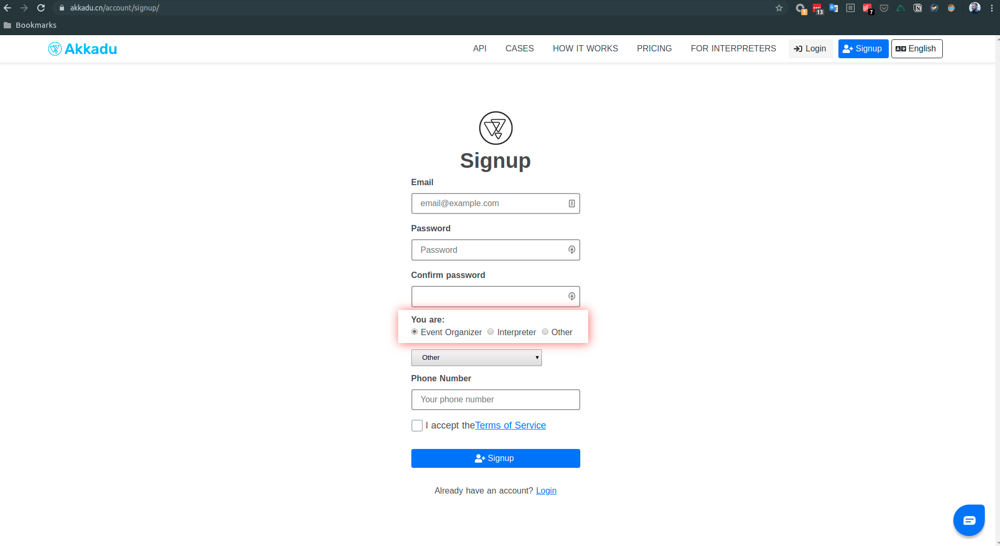
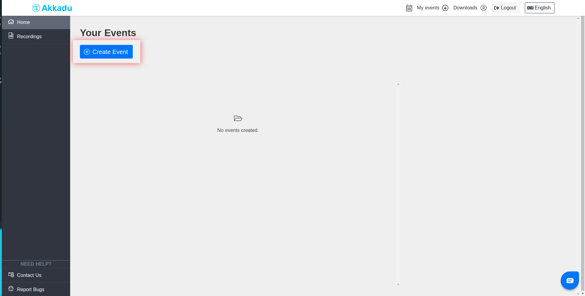
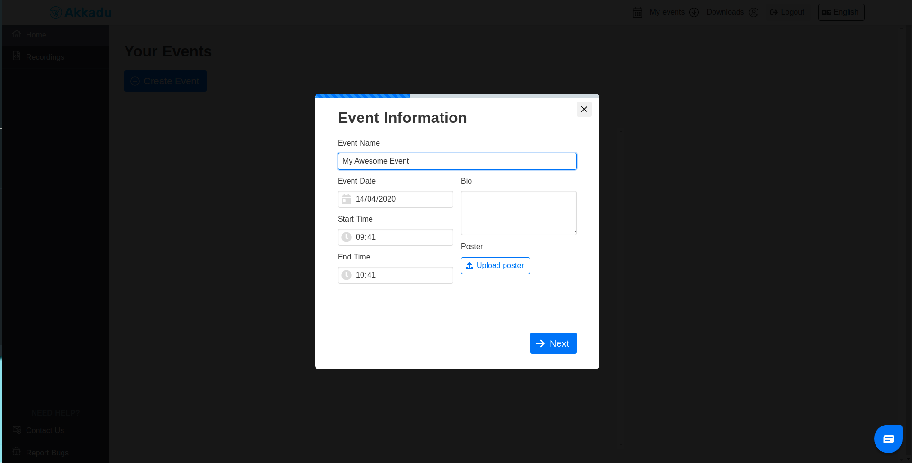
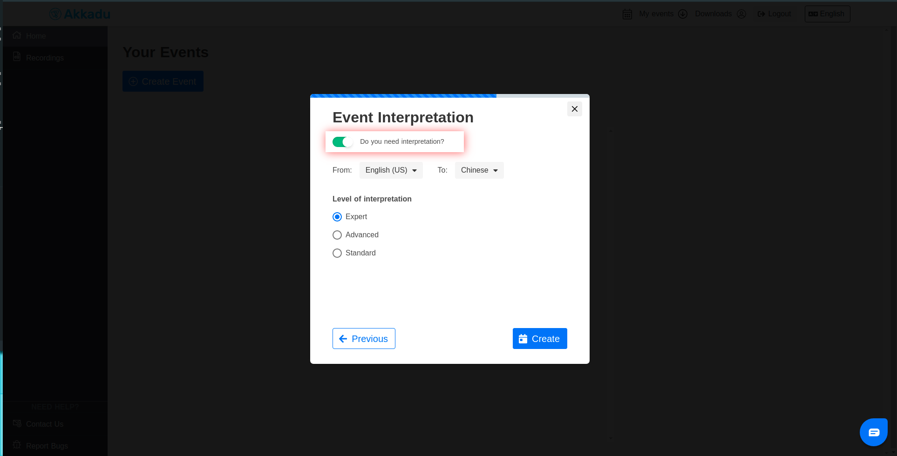
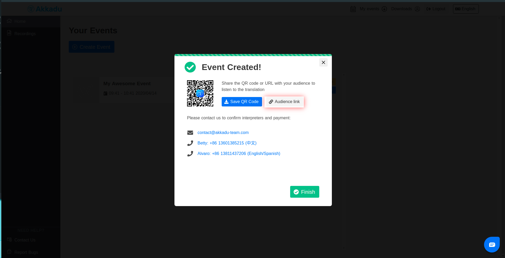

# Welcome to Akkadu API!

The goal of this repository is to provide information on how to integrate Akkadu interpretation into your platform.


For Chinese version of this doc, visit this [link](README_CN.md) please.
(中文版介绍文档，请访问[此链接](README_CN.md).)

## Getting Started

This feature is still in limited beta testing and we are open to feedback and ideas and feature requests! Please 
do not hesitate to open an issue here or contact us at techforce@akkadu-team.com!

### Authentication

Akkadu-RTC package is shared as a private NPM module, and in order for you to install the packages, you need to
acquire a token at techforce@akkadu-team.com.

### About configuration

There are different configurations for development and for production. They 
are discussed later in section "Development Environment vs Production Environment".
To get you started easily we have created an open room and user configuration that you will connect to automatically.
The default mode is development mode.

### Running the server

run
```
yarn install
```

run
```
yarn start
```


### Receiving audio

head over to localhost:3000

You should see a simple buttom. Clicking that button will start subscibing to our interpreter stream.
The code for this can be found at

```
./server/views/receiver.ejs
```

We have provided you with simple shared testing room with configuration
```
 const config = {
    roomName: 'ejrd',
    isDevMode: true
  }
```

In order to receive audio, someone of course needs to be broadcasting audio. For this testing setup
we have integrated our broadcaster as well, so you can experience the streaming with a simple setup.
See "Broadcasting Audio" for further details


### Broadcasting Audio 

For this testing setup you can head over to

http://localhost:3000/broadcaster

We have provided you with default configurations of

```
const config = { roomName: 'ejrd', isDevMode:true }
const username = 'akkaduinterpreter1@outlook.com'
const password = 'Interpreter1'
```

These will connect to a shared room. Note! The broadcaster allows only one connection to a room
at a time, and since these credentials are shared (for now) you might hear other people testing
or experience your broadcast suddenly stopping.

Because of this we highly recommend seeing steps outlined in "Managing your event configurations"


## Managing your event configurations

### Development Environment vs Production Environment

The reason for this distinction is security. We provide our services from two
domains: 'devapi.akkadu.cn/com' and 'api.akkadu.cn/com' and we only allow
localhost access on devapi. Hence in order for you to use our testing 
setup on your localhost, you need to be connected to devapi and conversely
on production you want to be connecting to our api.
We are aware that this is inconvenient for development, and will seek to simplify
this in the future via developer account access.

The Akkadu RTC sdk will by default try to connect to our production servers, if you
do not pass in the configuration variable of "isDevMode:true". Hence on localhost
development remember to pass in that configuration in order to avoid CORS issues.

An important note is that events are unique to both production and dev environments,
so an event created in dev mode will not work in production mode.

**In order to have a smooth experience, please refer to checklists provided below:**

#### Production checklist
- [ ] I have provided CORS domain information to Akkadu
- [ ] I have created an event at akkadu.cn/com
- [ ] I have coordinated with Akkadu about event interpretation at contact@akkadu-team.com or otherwise
- [ ] I have passed in the correct roomName of the event to Akkadu RTC
- [ ] I have set isDevMode:false

#### Development checklist
- [ ] I have acquired testing event details from techforce@akkadu-team.com (you can have multiple)
- [ ] I have set isDevMode:true


### Creating your own event (available on production only)


#### 1. First signup as an eventorganizer on akkadu.cn/com




#### 2. Create an event and request interpretation

Click to create event



---

Insert event details.



---

Request interpretation



---

Copy url of the event




#### 3. The new roomName of your event is in the query at ?e=<--Your-room-hash-->
You can now pass this as configuration to Akkadu RTC to be able to receive interpretation
from this new event.

#### 4. Refer to "Production checklist" to make sure everything is in order


## Using the SDK
### Implement the module in your project 
* This module is an ESM module, and may need to be babelify in order to be used. 
* Some [loading](https://github.com/babel/babel-loader/issues/171) issue can occurs when used on a vueJs project.
* In our case you would need to add :
exclude: /node_modules\/(?![@akkadu/akkadu-rtc])/


Functionalities are exposed through the @akkadu/akkadu-rtc package.

**This can only be installed with proper npm permission, please see "Authentication"**

### Audience (Receiver)


#### Importing

```
import Akkadu from '@akkadu/akkadu-rtc'

async function initAkkadu() {
  // see "Managing your event configurations"
  const config = {
    roomName: undefined
  }
  const akkaduRTC = new Akkadu(config)
  // Importing of sub-modules is dynamic and depends on the environment. Since we only want to load the things we need this to be async
  streamer = await akkaduRTC.init() // you can also use "initReceiver"
}
```

#### Usage

The streamer exposes one simple functionality for now, this is the toggle function.
It simply toggles the stream on and off when called.

```
/*
 * @description toggles audio on and off
 * @returns {void}
 */
streamer.toggle()
```


### Interpreter (Broadcasting)


```
import Akkadu from '@akkadu/akkadu-rtc'

async function initAkkadu() {
  // see "Managing your event configurations" 
  const config = { roomName: undefined }
  const username = undefined
  const password = undefined
  const akkaduRTC = new Akkadu(config)
  streamer = await akkaduRTC.initBroadcaster(username, password)
}
```

#### Usage

The streamer exposes one simple functionality for now, this is the toggle function.
It simply toggles the stream on and off when called.

```
/*
 * @description toggles audio on and off
 * @returns {void}
 */
streamer.toggle()
```


### Detecting connection state

As is added to the examples in the project already you can detect connection states of Akkadu RTC with a
streamer.on listener. The types of events fired are:

**connection-active**

This method is fired when all assets are loaded and the streamer is connected to the service.

It is good practice to wait for 'connection-active' method before allowing users or the page logic to toggle streaming.
This ensures that all the assets are loaded before playback is tried. For instance iOS devices need specific
polyfills to enable streaming which can take some time to load.


**connection-online**

This method fires when we have reconnected


**connection-offline**

This method fires when we have lost connection


#### Code example

```
streamer.on('connection-status',(msg) => {
        const { id } = msg
        switch (id) {
          case 'connection-active':
            console.log('Akkadu Connection active!')
            akkaduActive = true
            akkaduOnline = true
            break
          case 'connection-offline':
            console.log('Akkadu Connection offline!')
            akkaduOnline = false
            break
          case 'connection-online':
            console.log('Akkadu Connection online!')
            akkaduOnline = true
            break          
        }
  })
```

#### Future features

- [ ] Create external dev auth solution for packages
- [ ] Allow dev cors on production
- [ ] Create external dev auth solution for APIs
