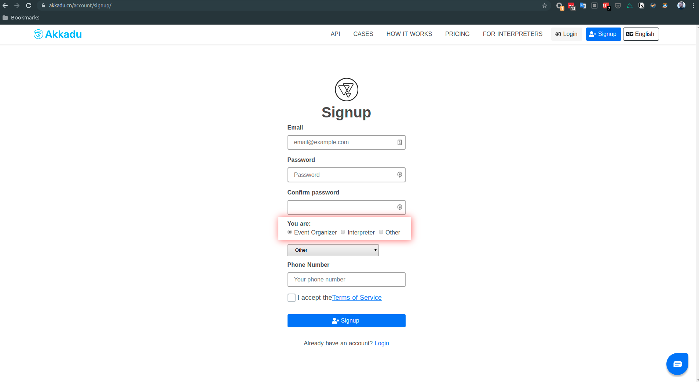
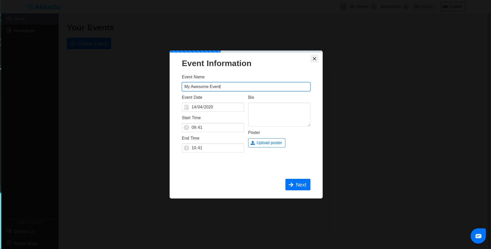
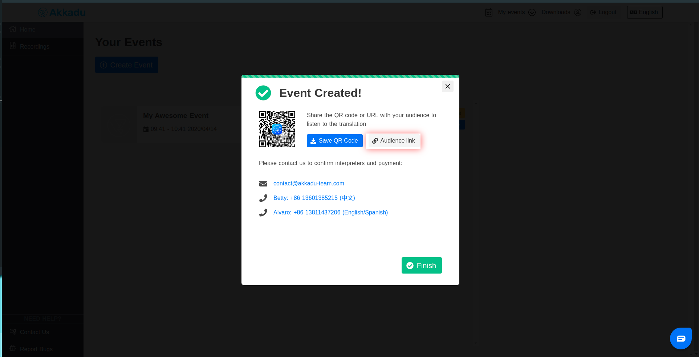

# 欢迎来到Akkadu API！

本代码库主要目的是为了提供如何将Akkadu翻译服务集成到您平台上的信息。

For English version of this doc, visit this [link](README.md) please.

## 准备开始

本功能仍处于beta测试中，我们很乐意接受您的反馈和功能请求！如有问题，请在本代码库提交一个问题请求，或与我们取得联系，邮件地址是techforce@akkadu-team.com。

### 身份认证

Akkadu-RTC开发包可以通过私有的NPM库获取，如果您想要安装这个开发包，你需要与我们联系取得一个令牌（token），联系邮件techforce@akkadu-team.com。

### 关于设置

开发环境和生产环境的设置有一些区别，它们会在“开发环境 vs 生产环境”部分进行讨论。

为了使您可以轻松地创建一个开放房间，和用于连接房间所需的用户设置，默认的模式已被设置为开发模式。


### 运行服务

执行
```
yarn install
```

执行
```
yarn start
```


### 接收音频

用浏览器访问http://localhost:3000

你应该可以看到一个简单的按钮。点击那个按钮，你将会订阅到我们的翻译员音频流。
相关代码可以在如下文件中找到：


```
./server/views/receiver.ejs
```

我们已经提供了一个简要的测试房间和配置信息:
```
 const config = {
    roomName: 'ejrd',
    isDevMode: true
  }
```

为了接受音频，必须要有所接受的播放音频。为了构建测试环境，我们也已经集成了广播组件，您可以简单的配置后就可以进行体验。

更多信息，请查看“广播音频”部分。


### 广播音频 

为了测试广播配置环境，您可以用浏览器打开地址 http://localhost:3000/broadcaster


我们已经为了提供了如下默认配置：

```
const config = { roomName: 'ejrd', isDevMode:true }
const username = 'akkaduinterpreter1@outlook.com'
const password = 'Interpreter1'
```

这些配置将会吧您连接到一个共享房间。注意！本广播组件在同一个时间，仅允许连接一个房间，并且，因为所用的配置当前是共享的，您可能会听到其他人在进行测试，或者遇到广播突然停止的情况。

正因如此，我们强烈建议你查看“管理您的活动配置”部分内容。


## 管理您的活动配置

### 开发环境 vs 生产环境

之所以区别两者，主要是为了安全问题。我们通过如下两个地址提供服务： ‘devapi.akkadu.cn/com’和‘api.akkadu.cn/com’, 且我们仅允许本地（localhost）来访问devapi服务器所提供的服务。因此，为了在本地使用测试配置，您需要链接devapi服务端；相应的，在生产环境，您需要连接我们的api服务器。

我们已经意识到了可能会给开发带来不变，并且会在未来通过开发者账号来简化配置流程。


如果在配置中，不设置"isDevMode:true"参数的话，Akkadu RTC开发包将会默认连接我们的生产服务器。因此，在本地开发端，请记得配置参数以避免跨站请求(CORS)问题。

另外一点需要注意的是，在生产环境和开发环境所创建的活动是独有的，所以，在开发模式创建的活动，将不会在生产环境运行。


**为了让您拥有一个轻松的体验，请参考如下配置清单**


#### 生产环境配置清单
- [ ] 我已经向Akkadu提交了跨站请求信息；
- [ ] 我已经在akkadu.cn/com上创建了一个活动；
- [ ] 我已经与Akkadu就翻译活动问题进行了协商，联系邮件为contact@akkadu-team.com；或者
- [ ] 我已经为Akkadu RTC开发包配置了正确的房间信息；
- [ ] 我已经设置了 `isDevMode:false`

#### 开发环境配置清单
- [ ] 我已经通过与techforce@akkadu-team.com联系取得了测试活动的详情（你可以拥有多个测试活动）；
- [ ] 我已经设置了` isDevMode:true`；


### 创建属于您自己的活动 (仅限于生产环境)


#### 1. 在akkadu.cn/com注册一个活动组织者




#### 2. 创建一个需要翻译的活动

点击创建活动


---

输入活动信息



---

请求翻译


---

复制活动的网址




#### 3. 活动房间的名称在网址中的` ?e=<--您的房间号-->`部分
为了接受活动的翻译数据，您现在可以将该字符串作为配置传给Akkadu RTC。


#### 4. 请参考“生产环境配置清单”部分来确定一切按顺序进行


## 使用本开发包

功能可以通过@akkadu/akkadu-rtc库获取。


**本开发包只能通过适当的npm权限配置来安装，请查看“身份认证”部分**


### 观众 (接收端)


#### 导入

```
import Akkadu from '@akkadu/akkadu-rtc'

async function initAkkadu() {
  // 查看 "管理您的活动配置"部分
  const config = {
    roomName: undefined
  }
  const akkaduRTC = new Akkadu(config)
  // 取决于环境配置动态导入子模块，我们只需要异步载入
  streamer = await akkaduRTC.init() // 你也可以使用"initReceiver"
}
```

#### 使用

当前播放模块只开放了一个简单的开关功能，其可以开放或关闭音频流。

```
/*
 * @description toggles audio on and off
 * @returns {void}
 */
streamer.toggle()
```


### 翻译员 (广播)


```
import Akkadu from '@akkadu/akkadu-rtc'

async function initAkkadu() {
  // 请查看"管理您的活动配置"部分 
  const config = { roomName: undefined }
  const username = undefined
  const password = undefined
  const akkaduRTC = new Akkadu(config)
  streamer = await akkaduRTC.initBroadcaster(username, password)
}
```

#### 使用

本模块当前只开放了一个丹丹的开关功能，其可以开放或关闭音频流。

```
/*
 * @description toggles audio on and off
 * @returns {void}
 */
streamer.toggle()
```


### 检测连接状态

您可以通过streamer.on listener来检测Akkadu RTC的连接状态。触发事件的类型是：


**connection-active**

当全部资源载入且播放流已经连接后，此事件会被触发。

在允许用户或者页面逻辑操控音频流前，最好先等待'connection-active'事件触发。这会确保在回放运行前，所有的所用资源全部已经载入。例如，iOS设备需要来启用音频流特别的兼容组件，可能需要一些事件来载入。


**connection-online**

当连接成功后，本事件会被触发。


**connection-offline**

当连接失去后，本事件会被触发。


#### 代码示例

```
streamer.on('connection-status',(msg) => {
        const { id } = msg
        switch (id) {
          case 'connection-active':
            console.log('Akkadu Connection active!')
            akkaduActive = true
            akkaduOnline = true
            break
          case 'connection-offline':
            console.log('Akkadu Connection offline!')
            akkaduOnline = false
            break
          case 'connection-online':
            console.log('Akkadu Connection online!')
            akkaduOnline = true
            break          
        }
  })
```

#### 未来功能

- [ ] 为开发包创建外部的验证方案
- [ ] 在生产环境许可跨域的开发
- [ ] 为开发接口穿件外部的验证方案
